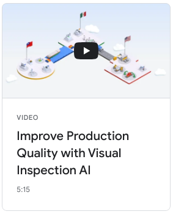
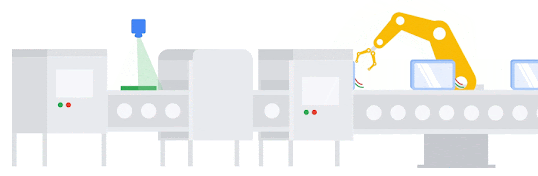

# Visual Inspection AI (VIAI) Edge Solution

VIAI Edge is a solution developed by Google Cloud's [Global Solutions Engineering team](https://cloud.google.com/solutions).

This solution extends Google Cloud's [Visual Inspection AI](https://cloud.google.com/solutions/visual-inspection-ai) service to run on an Edge server. This allows fast inference and facilitates the integration with on-premise processes.

Browse the [VIAI site](https://cloud.google.com/solutions/visual-inspection-ai) for features, use cases and other useful information and [watch this video](https://youtu.be/60Sk-mq3Cr8) to understand how the solution works.

## Deployment

Take a look at the [deployment manual](https://googlecloudplatform.github.io/solutions-viai-edge-provisioning-configuration/) to understand the requirements and steps to deploy the solution.

If you are interested in deploying the solution, contact your Google Cloud [sales representative](https://cloud.google.com/contact/) or [Google Cloud partner](https://cloud.google.com/solutions/visual-inspection-ai#section-10).

## Contributing

If you'd like to contribute to the solution, please review the [contributing guidelines](./CONTRIBUTING.md).

## Development

For information about development environment setup, conventions, standards,
and processes, see [develop VIAI Edge](./docs/development.md).

