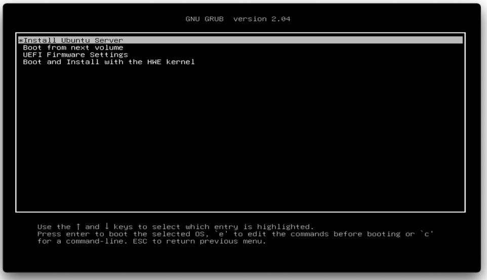
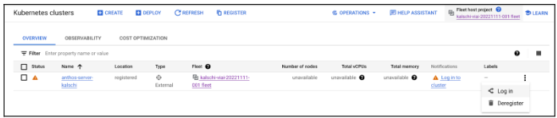
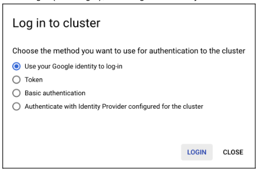
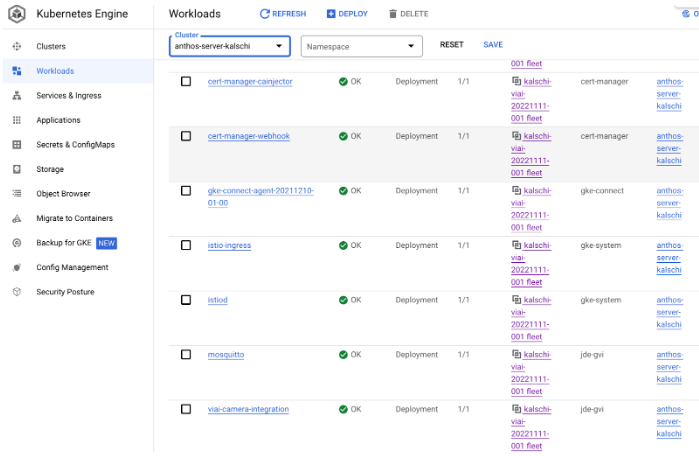

# Deployment

## Booting up the physical server for the first time

<br>

__Connecting the physical server__

1. Connect the local LAN Ethernet cable to the server’s lowest numbered ethernet port.
2. Connect a monitor to the server’s lowest numbered HDMI port
  Optionally, connect a serial console to the serial console port (refer to the server vendor manual for specific instructions and cables, serial terminal requirements)
3. Connect a USB keyboard to one of the USB ports on the server.
4. Plug the OS installer USB flash drive into the server.
5. Plug the installer configuration data USB flash drive into the server.
6. Connect the camera to the same local LAN network segment as the server, using its PoE network + power adapter. You should connect both the server and the camera to the same local network GigE switch, to minimize networking delays and maximize bandwidth.
7. Connect the AC power cord to the server.

<br>

__Booting up for the first time__

Warning: This procedure will wipe all the data that is currently in the server.

1. Power on the server.

If the server does not boot directly from the Ubuntu OS installer USB flash drive, you may need to change the position of the USB flash drivers and/or its BIOS boot settings. You must set the USB drive which contains the Ubuntu distribution as the server boot device.

* Power cycle the server.
* Make sure that the USB keyboard is connected properly.
* Press `Esc` or `Del` (could also be `F2`) when you see the first flash screen to enter the BIOS settings.

Once in the BIOS, there are a few things you can try. They will depend on the server model and make you are using:

* Under the Boot Option Priorities, locate your USB flash drive. It might be labeled `[UEFI: SanDISK]` or similar.
  * Use the `+` and `-` keys to rearrange the boot order, and move the USB flash drive to the top fo the list, in the Boot Option #1 position.
  * Some BIOS also allow to select the boot device pressing `F12` or similar when the server is starting up.

* Disable Secure Boot
  * Find `Secure Boot`, `TPM` and/or `Security Device Support` and set them to `Disabled`.

* Navigate to the Chipset -> System Agent (SA) Configuration -> Graphics Configuration.
  * Set `Primary Display` to `HDMI`. This sets the server's motherboard HDMI port 1 as the primary console display port, leaving the GPU PCI card for ML acceleration tasks.

* Navigate to Save & Exit
  * Select `Save Changes and Reset`
  * Confirm when prompted

If all the settings are correct, you will see a sceen similar to this:



<br>

2. If asked, boot via the Ubuntu OS installer USB flash drive.

The OS installer will boot and load the installation configuration from the second USB flash drive (installer configuration data).
For more information on this process, refer to [cloud-init NoCloud](https://cloudinit.readthedocs.io/en/latest/introduction.html).

<br>

3. The installer will ask for confirmation before perfoming any changes to the server disk.

When you see a prompt asking `Continue with autoinstall? (yes|no)` <br>
Type `yes <enter>`

The machine might reboot during the installation if any OS package requires a restart to finalize its upgrade.

After the first automated reboot, you should see a console message similar to this:

`Ubuntu 20.04.3 LTS viai-nexcom tty1`

At this point, the system is still installing packages. The installation is finished when you see the following message:

`[ OK ] Reached target Cloud-init target.`

_Note:_ If the server shows the console message, but does not show any signs of progress for a long time, you can try to hard reset the server, and when the boot screen appears, use the arrow keys to select `Boot and Install with the HWE kernel` instead. Some newer servers will only boot correctly with this setting.

<br>

4. Log in to the system.

To find out the IP address, log in via the console first.

Default username is `viai-admin` and the default password is `viai-admin`.

After the first log in, the shell will ask you to change the default password. This ensures you don’t leave a device accessible via SSH with a known, clear-text. We recommend that, even after changing the password, you set up [key-based authentication](https://www.ssh.com/academy/ssh/public-key-authentication) and disable password-based authentication.

After you log in, the shell should display the server’s IPv4 address. From here onwards, you can SSH to the server using the following command from the your host machine (if they are on the same network): `ssh viai-admin@<server-ip-address>`

<br>

__Verifying the server installation status__

After the automated server installation completes, execute the following steps to check that the drivers and containerized applications are working properly.

On the _edge server_, do the following:

1. Verify that 2 secrets have been added:

```bash
sudo su
export KUBECONFIG=/var/lib/viai/bmctl-workspace/${MEMBERSHIP}/${MEMBERSHIP}-kubeconfig
export NAMESPACE=<YOUR KUBERNETES NAMESPACE>
kubectl get secrets -n ${NAMESPACE}
```

The default namespace value is `viai-edge`

The command output should be similar to this:

```text
NAME                  TYPE                                  DATA   AGE
default-token-p8pt5   kubernetes.io/service-account-token   3      1h
pubsubcred            kubernetes.io/dockerconfigjson        1      1h
regcred               kubernetes.io/dockerconfigjson        1      1h
```

<br>

__Verifying that the server is attached to Anthos__

To verify if the edge server is attached to Anthos, Go to [Google Cloud console, Kubernetes Engine, Clusters](https://console.cloud.google.com/anthos/clusters).

You should see the cluster you just created.



To verify if your user account is correclty granted the required roles:

* Click the three dots on the far right (scroll if needed)
* Click Log In
* Select `Use your Google identity to log-in`



To verify if Visual Inpection AI Edge solution isproperly installed, in the Google Cloud Console, go to Kubernetes Engine, Workloads.

You should see `viai-camera-integration` and `mosquitto` deployments with `OK` status.



At this point the edge server is ready, you can continue in the [Connecting the cameras](./connectingcameras.md) section.

</br>

___

<table width="100%">
<tr><td><a href="./deployedge.md">^^^ Deployment of the solution</td><td><a href="./connectingcameras.md">Connecting cameras >>></td></tr>
</table>
