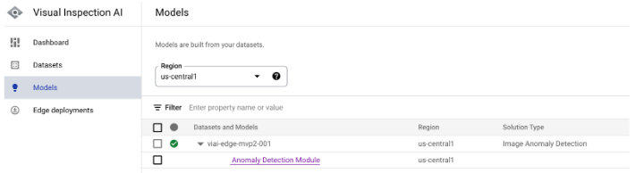
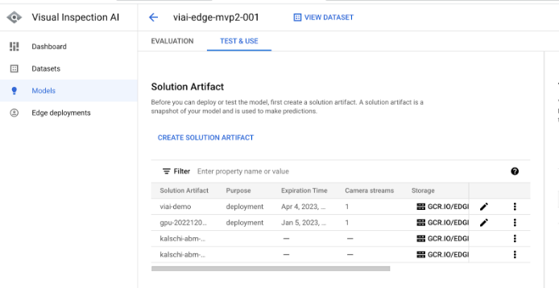
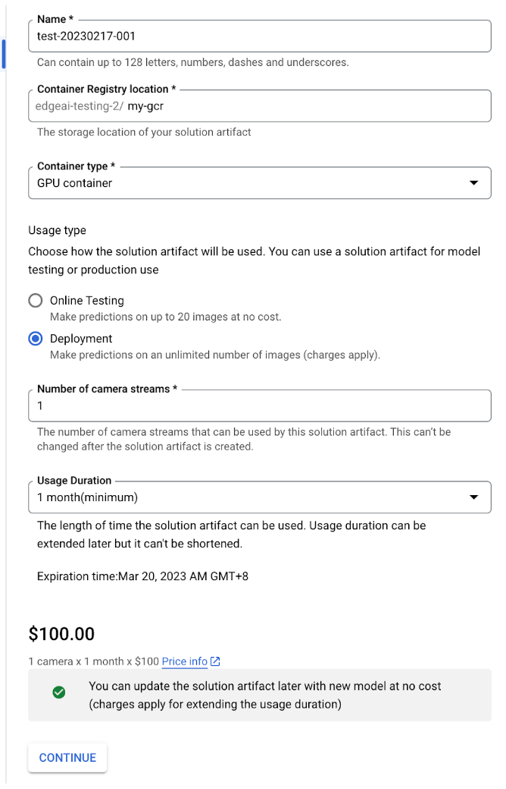
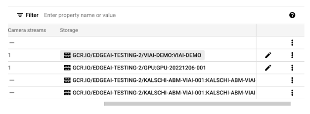
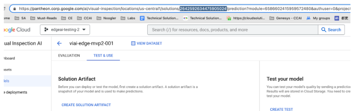
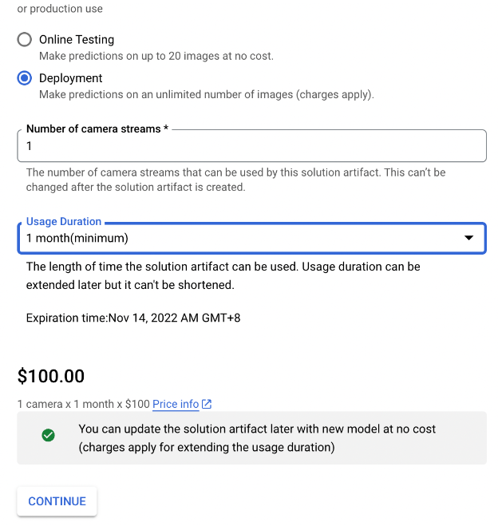

# Visual Inspection AI Edge Solution

# Exporting the model to a registry

<br>

After you trained a model, to run the model on the edge server and get inference results, the next step is to create the solution artifacts. You can use the Google Cloud Console for Visual Inspection AI service, or command line scripts to create a solution artifact.

<br>

__Note on model acceleration on the edge server:__ When you create the solution artifact, you can choose if the VIAI service compiles the model for x86 CPU, or NVIDIA GPU acceleration. If your server has a compatible GPU model, and runs only 1 VIAI model, you should export the model for GPU acceleration. If your server will run multiple VIAI models, or does not have a suitable GPU card, you can export the model for x86 CPU acceleration. Please refer to the chapter <<INSERT LINK>> Using multiple cameras, with dedicated ML models, triggered simultaneously for more information on how to compile ML models for CPU or GPU, and run multiple models on the same server simultaneously.

<br>

__Option 1 - Exporting the VIAI ML model to Google Cloud Container Registry__

If this is the first time you use this solution, it is recommended to use Google Cloud Console to create the solution artifacts. This will generate and store the model container image to Container Registry.

1. In the Google Cloud Console, go to Visual Inspection AI -> Models -> expand the model you trained in the previous sections.



2. Click the model type link (in the previous example it would be 'Anomaly Detection Module'). This will take you to the evaluation page.

3. Under the 'Test and Use' tab, click 'Create Solution Artifact'



4. Fill in the required fields, click 'Continue', then confirm purchase.



5. Once the model container has been generated, take note the container image URL



<br>

__Option 2 - Exporting the VIAI ML model to Artifact Registry__

To export a trained VIAI model container with GPU accelration to Google Cloud Artifiact Registry, follow the next steps:

1. In the Google Cloud Console, go to Visual Inspection AI -> Models -> expand the model you trained in the previous sections. 
Take note of the part of the URL highlighted, set an environment variable with that value.



```bash
export SOLUTION NUMBER=<your solution number>
```

2. Generate a token and export it as an environment variable.

```bash
gcloud auth print-access-token
```

```bash
export ACCESS_TOKEN=<your access token>
```

3. Review the value of `DISPLAY_NAME` and prepare the rest of the environment variables.

```bash
export DISPLAY_NAME=<your model name>

export PROJECT_NUMBER=$(gcloud projects list --filter="$DEFAULT_PROJECT" --format="value(PROJECT_NUMBER)")
export VIAI_REGION=europe-west4

export ARTIFACT_REGISTRY_URL="${DEFAULT_REGION}-docker.pkg.dev/${DEFAULT_PROJECT}/viai-models/${DISPLAY_NAME}:gpu-20221014003"

export SOLUTION_ARTIFACTS_URL=https://${VIAI_REGION}-visualinspection.googleapis.com/v1/projects/${PROJECT_NUMBER}/locations/${VIAI_REGION}/solutions/${SOLUTION_NUMBER}/solutionArtifacts
```

4. Prepare the API call to upload the model to Artifact Registry.

Note that you will need to define an expiration time for the solution artifact. This is done specifying an epoch value for `seconds`, in the example below `1668386001` translates to Nov 14, 2022. Change that value as needed. Keep in mind that you might incur in additional charges. You can see an estimation on the [Artifacts Registry pricing page](https://cloud.google.com/artifact-registry/pricing). 

```bash
rm /tmp/body.json

cat <<EOF >> /tmp/body.json
{"display_name": "${DISPLAY_NAME}", "enable_aiplatform_model_upload": false, "export_type": "GPU_CONTAINER", "container_export_location": {"output_uri": "${ARTIFACT_REGISTRY_URL}"}, "expire_time": {"seconds": 1668386001}, "camera_count": 1, "purpose": "deployment"}
EOF
```

5. Run the API call

```bash
curl --location --request POST ${SOLUTION_ARTIFACTS_URL} \
    --header "Authorization: Bearer ${ACCESS_TOKEN}" \
    --header "Content-Type: application/json" \
    --data "@/tmp/body.json"
```

6. Verify that the container is accessible from Artifact Registry

```bash
gcloud auth configure-docker europe-west4-docker.pkg.dev
docker pull ${ARTIFACT_REGISTRY_URL}
docker run \--rm --name "test_cpu" \-p 8601:8601 -p 8602:8602 -p 8603:8603 \-t ${IMAGE_TAG}
curl localhost:8602/statusz
```

You should see output similar to this:

```
Container is valid until: 2022-11-04T00:20:25+00:00
```

<br>

__Cost__

Exporting the model in Deployment mode means that you want to deploy this model to a production environment and start serving production images. This will incur service charges. In the Solutions Artifacts creation console you can see charges for different configurations.




<br>

At this point the ML has been exported. You can continue to the next section to [deploy your ML model to the edge server](./modeltoedge.md)


<br>

___

<table width="100%">
<tr><td><a href="./modeltoedge.md">Deploy your ML model to the edge server >>></td></tr>
</table>


