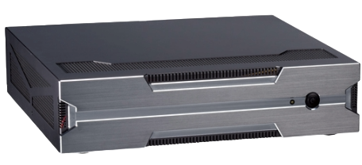
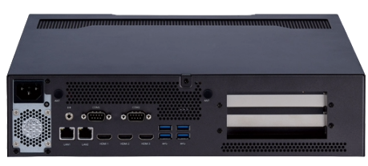
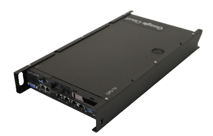
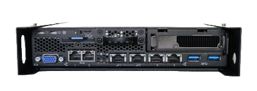

# Pre-requisites

## General Pre-requisites

__Hardware__

* Supported server hardware [(see below)](#supported-gateway-servers) or existing Kubernetes cluster available
* Supported camera model available
* For a dedicated server deployment:
  * Gigabit Ethernet LAN network with DHCP and internet access
  * Or an air-gapped local isolated LAN, still with DHCP but no internet
  * AC power
  * HDMI monitor or Serial console
  * USB keyboard
  * A USB flash drive of at least 4 GB for the OS installer
  * A USB flash drive of at least 1 GB for the installer configuration data
  * Another Linux or macOS system to prepare the installation media
* Software, installed on the installation person’s Linux or macOS machine
  * Docker Engine (tested with version 20.10.2)
    * Please follow [this instructions](https://docs.docker.com/engine/install/ubuntu/) to install Docker Engine if not already.
    * This document assumes that the user running Docker Engine commands has the rights to manage the Docker daemon without requiring root privileges. For more information, see [Manage Docker as non-root user](https://docs.docker.com/engine/install/linux-postinstall/#manage-docker-as-a-non-root-user).
  * Git (tested with version 2.33)
* Google Cloud
  * A Google Cloud [organization](https://cloud.google.com/resource-manager/docs/cloud-platform-resource-hierarchy#organizations)
  * An active [billing account](https://cloud.google.com/billing/docs/how-to/manage-billing-account)
  * A Google account with the [Project Creator role](https://cloud.google.com/iam/docs/understanding-roles#resource-manager-roles) for the Google Cloud organization
* Google Cloud connectivity
  * The workstation that creates cloud resources must have connectivity to Google Cloud.
  * The edge server that runs the VIAI edge application must connect to Google Cloud during the installation process
* On-premises IP address allocation.
  * You need control over the IP address allocations in your target edge environment.
  * The Allocated IP address will not be changed after the edge server is configured.
  * Four IP addresses, which are:
    * Control Plane IP address
    * Load Balancing control plane IP address
    * Ingress IP addresses (at least two IP addresses are required)
* Google source repositories access
  * The solution source code is on GitHub with public access.
  * At this point in time, the camera application code resides in a private Google repository. Access will be provided when requested.
* Required Roles to provision Cloud Resources. You must have roles listed below to provision GCP resources. Ask your administrator to assign you to these roles if not already.
  * Project Editor
  * Project IAM Admin
  * BigQuery Data Editor
  * Cloud Functions Admin
  * Pub/Sub Admin
  * Source Repository Administrator

 

___

## Supported Cloud Regions and services

The Visual Inspection AI Service today is a preview service and requires your Google Cloud
project to be allowlisted before you can use it. When the document is written, the Visual
Inspection AI Service is only available in __us-central1__ and __europe-west4__ regions.

This is a list of the services that will be provisioned by Visual Inspection AI Edge solution.
You can find full location support for each service in the official [Google Cloud locations documentation](https://cloud.google.com/about/locations#europe).
* Anthos and Anthos Configuration Management
* Artifact Registry
* Bigquery
* Cloud Deploy
* Cloud Workflow
* Cloud Functions
* Compute Engine instance with T4 GPU (as sandbox environment, optional)
  * T4 Availability can be found [here](https://cloud.google.com/compute/docs/gpus/gpu-regions-zones).
  * Supported other GPU models: P100, V100s
* Container Registry
* Cloud Pub/Sub
* Cloud Storage
* Eventarc
* Source Repository

Today Cloud Functions is not available in europe-west4 region. Below is a table list Visual
Inspection AI Edge solution recommended region configuration.  

| Service / Solution   | Visual Inspection AI Service | Visual Inspection AI Edge solution |
|----------------------|------------------------------|------------------------------------|
| Configuration for US | us-central1                  | us-central1                        |
| Configuration for EU | europe-west4                 | __europe-west3__                   |

    __Note:__ Should we just add instructions here? Details to allowlist your Google Cloud project for using Visual Inspection AI service is out of the scope of this document.

 

___

## Supported deployment models

The solution supports three deployment options:
1. Dedicated server. 
    a. You have an edge server that you wish to install Visual Inspection AI Edge applications on. 
    b. The server will be WIPED out

2. Existing Anthos Bare Metal clusters. 
    a. You already have the Anthos Bare Metal cluster configured, you just want to install Visual Inspection AI Edge applications on the existing Anthos Bare Metal cluster.

3. Sandbox GCE instance. 
    a. You want to explore the Visual Inspection AI Edge applications and do not wish to set up the solution on a physical server. Instead, you want the solution to create a GCE instance as the sandbox environment so you can verify the solution.

    __NOTE:__ Add the flowchart?????

 

___

## Supported IP Address configurations

To configure Anthos Bare Metal clusters, you must specify at least four IP addresses for Anthos.
For more details please refer to [Anthos documentation](https://cloud.google.com/anthos/clusters/docs/bare-metal/latest/installing/bundled-lb#requirements).

You can optionally choose to use physical IP addresses if you have specific needs, for example, your existing Anthos cluster already has external load balancer nodes and you want to [manually configure them.](https://cloud.google.com/anthos/clusters/docs/bare-metal/latest/installing/manual-lb)

 

___

## Supported GPU and CPU architectures

The Visual Inspection AI product compiles the trained ML models to run on either x86 CPU
architecture, or NVIDIA GPU architecture. By using a GPU, the ML inference processing can be
offloaded from the server CPU, and the GPU inference latency is significantly lower. However
the x86 CPU is still a valid option for servers that otherwise meet the minimum requirements but
cannot host a GPU card.
The supported NVIDIA GPU architectures are: sm_60,sm_61,compute_70,compute_75
The know to work GPU card models are: NVIDIA RTX 3080/3090, T4, P100, V100

 

___

## Supported gateway servers

The following server hardware can be considered as the reference server, but other x86 servers can be used as
well, as long as they provide sufficient hardware resources. Please refer to the reference HW
details below for requirements.

*Note:* at the moment, the [Genicam Python module](https://pypi.org/project/genicam/) does not support ARM architecture. Due to
    that dependency requirement, this solution can only run on x86 CPU servers for the time being.
    If Genicam cameras are not required, but ARM servers are required, technically it is possible to
    disable loading the Genicam module. Contact the authors in this case.

[__Nexcom AIEdge-X300-RTX30__](https://www.nexcom.com/Products/multi-media-solutions/ai-edge-computer/nvidia-solutions/ai-edge-computer-aiedge-x-300-rtx30#) 

|   |
      |
-------------------------|--------------------------------|
| SKU #                  | AIEdge-X300-RTX30              |
| Cooling design         | GPU Card with Active Cooling |
| Form factor            | Desktop                      |
| CPU                    | Intel i7-8700 6 cores 65W    |
| RAM                    | 32 GB                        |
| Storage                | 1TB SSD NVMe 2280 M.2 PCIex4 |
| Networking             | 2 x GbE                      |
| USB                    | 4                            |
| Display                | 3 x HDMI                     |
| Com ports              | 2                            |
| Power supply           | 850W / +12VDC Output / 110-240VAC Input |
| System dimensions      | 360mm(W) x 335mm(D) x 85mm(H) |
| Estimated weight (fully configured system) | 8 lbs / 3.6 Kg |
| GPU via PCIe x16 Gen3  | NVIDIA RTX 3080/3090 (e.g 30-series) |
| Suggested expansion Card dimensions within the limit | 290mm(L) x 121mm(W) x 43mm(H) |
| Data sheet             | [Link](https://www.nexcom.com/Products/multi-media-solutions/ai-edge-computer/nvidia-solutions/ai-edge-computer-aiedge-x-300-rtx30) |

 

[__Google Cloud Edge Appliance__](https://cloud.google.com/distributed-cloud/edge-appliance/docs/specifications) 

|   |
      |

|                        | EA-STORAGE-10                  | EA-GPU-T4         |
-------------------------|--------------------------------|-------------------|
| Processor              | 16 core CPU, 64GB RAM         |  NVIDIA T4 GPU, 16 core CPU, 64GB RAM |
| Storage                | 8x 2TB SSDs. Usable storage is 7.2 TB using RAID10 | 4x 2TB SSDs. Usable storage is 3.6 TB using RAID10 |
| Networking             | 2x 10GBASE-T RJ45, 2x 1GbE RJ45                    |
| Shipping weight         | 30 lbs / 13.6 kg                            |
| System dimensions      | Height: 43 mm (1.7 in.), width: 209 mm (8.2 in.), depth: 376 mm (14.8 in.) |
| Mounting options       | Horizontal or vertical orientation. Bookshelf mount (3 servers), DIN rail wall mount,   ceiling mount, 1U rack mount (2 servers), 2U short-depth rack mount (2 servers).  Available locking bezel with dust filter. |
| Appliance weight         | 8.3 lbs / 3.75 Kg |
| SKU           | [Link](https://cloud.google.com/skus/?currency=USD&filter=edge+appliance) |
| Ordering   | [Link](https://cloud.google.com/distributed-cloud/edge-appliance/docs/request) |

 

__Google Cloud Compute Engine Sandbox__

If you do not have a suitable physical machine or want to evaluate the solution in a sandbox
environment, this solution provides scripts to provision a Google Compute Engine instance as a
sandbox environment. For details, please see Provision resources in Google Cloud.

__Note__ Add link to 'provision resources'

 

___

## Industrial camera requirements

* Camera resolution requirements

| | |
---------|-----------------
| Resolution (max) |  100M pixels |
| Resoultion (min) | > 1M pixels |
| Resolution guidance | The actual number of pixels in the image covers the smallest local defect instance on the surface to be at least 30 x 30 pixels and higher. The more pixels to cover each defect instance the better. |
| Resolution example | Inspect mobile phone backside with dimensions of 150mm x 70mm. The smallest defect are scratches with 3mm in Y-orientation and 2 mm in X-orientation. The recommended minimal X resolution is (150mm/3mm)x30pixels=50x30 pixels = 1500 pixels. The recommended minimal Y resolution is (70mm/2mm)x30pixels=35x30 pixels = 1050 pixels. |
| Other requirements | Depending on the environment where the camera will operate, please consider IP67 protection, Gigabit Ethernet |

 

* Lighting requirements

| | |
---------|-----------------
| Focus |  Focus is on object surface but not on background context |
| Light | Object is well and evenly lit (e.g. through ring light) |
| Other requirements | For flexible items (such as clothes) we recommend that they are put flat on an even surface before taking the images |

 

___

## Supported camera types

The solution aims to support a wide range of suitable cameras, by providing drivers for the following types:
* Genicam / GigE Vision IP cameras, including thermal cameras e.g FLIR
* RTSP with ONVIF support, or simple RTSP IP cameras
* USB cameras
* File, as in using image files as source data, if the camera system cannot be connected directly or via the network to the VIAI Edge server

 

___

<table width="100%">
<tr><td><a href="./terminology.md"><<< Terminology</td><td><a href="./deployment.md">Deployment >>></td></tr>
</table>
